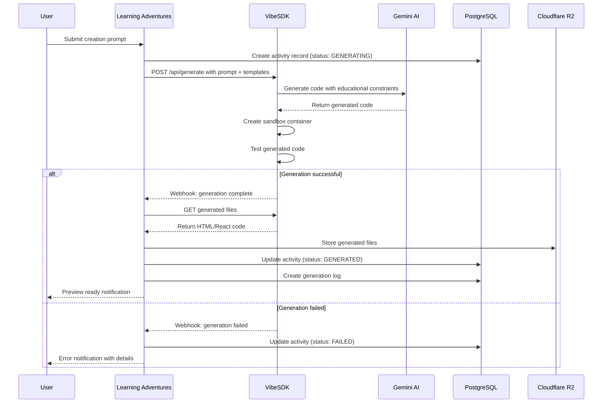
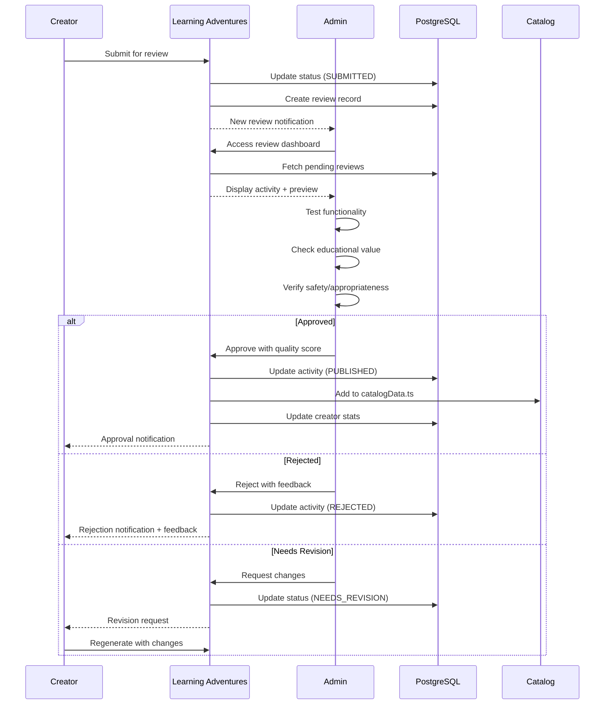
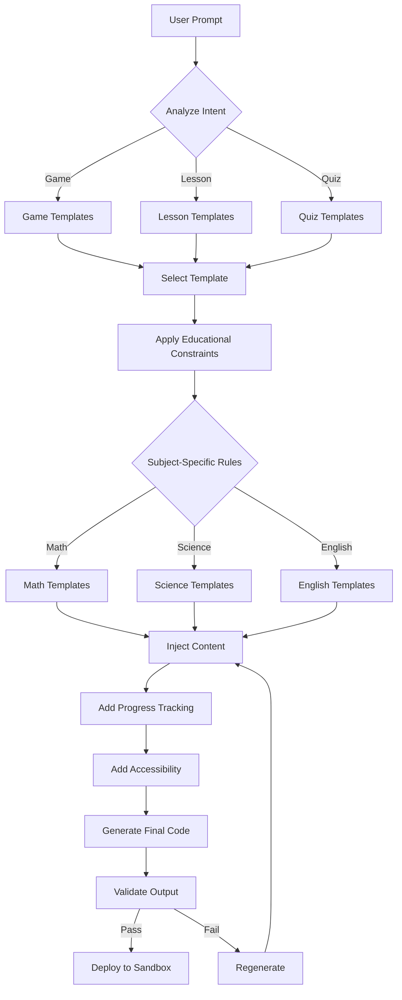

# Learning Adventures x VibeSDK Integration
## Technical Specification Document

**Version:** 1.0
**Date:** December 24, 2025
**Status:** Draft
**Author:** Platform Architecture Team

---

## 📋 Table of Contents

1. [Executive Summary](#executive-summary)
2. [System Architecture](#system-architecture)
3. [Data Models](#data-models)
4. [API Design](#api-design)
5. [Integration Flow](#integration-flow)
6. [Security & Compliance](#security--compliance)
7. [Subscription & Billing](#subscription--billing)
8. [Content Moderation](#content-moderation)
9. [Infrastructure & Deployment](#infrastructure--deployment)
10. [Migration & Rollout](#migration--rollout)
11. [Monitoring & Analytics](#monitoring--analytics)
12. [Cost Analysis](#cost-analysis)
13. [Timeline & Milestones](#timeline--milestones)

---

## Executive Summary

### Vision
Integrate Cloudflare's VibeSDK to enable educators, parents, and tutors to create custom learning activities through natural language, transforming Learning Adventures into a user-generated content platform.

### Core Value Proposition
- **For Educators**: Create custom activities in minutes without coding
- **For Students**: Access unlimited, personalized learning content
- **For Platform**: Scale content library exponentially with quality control

### Key Metrics
- **Target**: 1,000 creators in Year 1
- **Goal**: 10,000+ user-generated activities
- **Quality**: 95%+ approval rate for published content
- **Revenue**: $50K+ ARR from creator subscriptions

---

## System Architecture

### High-Level Architecture

```
┌─────────────────────────────────────────────────────────────┐
│                  Learning Adventures Platform                │
│                    (Next.js + PostgreSQL)                    │
└────────────┬─────────────────────────────────┬──────────────┘
             │                                 │
             │ REST API                        │ OAuth/Auth
             │                                 │
┌────────────▼─────────────────┐  ┌───────────▼──────────────┐
│   VibeSDK Instance           │  │   Content Pipeline       │
│   (Cloudflare Workers)       │  │   (Review & Publish)     │
│                              │  │                          │
│  • AI Code Generation        │  │  • Quality Validation    │
│  • Sandbox Environment       │  │  • Metadata Extraction   │
│  • Template System           │  │  • Catalog Integration   │
│  • Preview & Testing         │  │  • Version Control       │
└──────────┬───────────────────┘  └───────────┬──────────────┘
           │                                  │
           │ Webhooks                         │
           │                                  │
┌──────────▼──────────────────────────────────▼──────────────┐
│              Learning Adventures Database                   │
│                    (PostgreSQL)                             │
│                                                             │
│  • UserCreatedActivities                                    │
│  • ActivityGenerationLogs                                   │
│  • ContentReviews                                           │
│  • CreatorSubscriptions                                     │
└─────────────────────────────────────────────────────────────┘
```

### Component Breakdown

#### 1. Learning Adventures Platform (Existing)
- **Technology**: Next.js 14, React, TypeScript
- **Database**: PostgreSQL 14 with Prisma ORM
- **Auth**: NextAuth.js (Google, GitHub, Email)
- **Hosting**: Vercel (recommended) or self-hosted

#### 2. VibeSDK Instance (New)
- **Technology**: Cloudflare Workers, Containers
- **AI Model**: Google Gemini 2.5 Flash/Pro
- **Sandbox**: Cloudflare Containers (isolated environments)
- **Domain**: `create.learningadventures.com`

#### 3. Content Pipeline (New)
- **Technology**: Next.js API Routes + Background Jobs
- **Queue**: Cloudflare Queues or Bull (Redis)
- **Storage**: Cloudflare R2 for generated files
- **CDN**: Cloudflare CDN for serving content

#### 4. Admin Dashboard (Enhanced)
- **Technology**: React + existing AdminPanel
- **Features**: Content moderation, analytics, user management

---

## Data Models

### Database Schema Extensions

```prisma
// prisma/schema.prisma

// Existing User model (extended)
model User {
  id                    String                 @id @default(cuid())
  email                 String                 @unique
  role                  UserRole

  // New fields
  creatorProfile        CreatorProfile?
  createdActivities     UserCreatedActivity[]
  activityReviews       ActivityReview[]
  subscriptionTier      SubscriptionTier       @default(FREE)
  subscriptionStatus    SubscriptionStatus     @default(INACTIVE)
  monthlyGenerationCount Int                   @default(0)
  lastGenerationReset   DateTime?

  // ... existing fields
}

// New Creator Profile
model CreatorProfile {
  id                String   @id @default(cuid())
  userId            String   @unique
  user              User     @relation(fields: [userId], references: [id], onDelete: Cascade)

  displayName       String
  bio               String?
  organizationType  OrganizationType?  // SCHOOL, DISTRICT, INDIVIDUAL, TUTORING_CENTER
  verified          Boolean  @default(false)

  // Statistics
  totalActivitiesCreated Int  @default(0)
  totalPublished        Int  @default(0)
  totalViews            Int  @default(0)
  averageRating         Float?

  // Settings
  autoPublish          Boolean @default(false)
  allowRemixing        Boolean @default(true)
  defaultLicense       String  @default("CC-BY-NC-SA")

  createdAt         DateTime @default(now())
  updatedAt         DateTime @updatedAt
}

// User-Created Activities
model UserCreatedActivity {
  id                String   @id @default(cuid())

  // Creator info
  creatorId         String
  creator           User     @relation(fields: [creatorId], references: [id])

  // Activity metadata
  title             String
  description       String
  prompt            String   // Original natural language prompt

  // Classification
  subject           Subject
  category          Category
  gradeLevel        String[]
  difficulty        Difficulty
  skills            String[]
  estimatedTime     Int      // in minutes

  // Content
  type              ActivityType  // GAME, LESSON, INTERACTIVE, QUIZ, SIMULATION
  contentType       ContentType   // HTML, REACT_COMPONENT, IFRAME
  htmlPath          String?       // Path in R2 or public folder
  componentPath     String?       // For React components
  sourceCode        String?       @db.Text  // Generated code

  // Status & Publishing
  status            ActivityStatus  @default(DRAFT)
  publishStatus     PublishStatus   @default(PENDING_REVIEW)
  featured          Boolean         @default(false)
  catalogId         String?         @unique  // ID in catalogData when published

  // Generation metadata
  vibeSessionId     String?         // VibeSDK session ID
  aiModel           String?         // e.g., "gemini-2.5-flash"
  generationTime    Int?            // milliseconds
  iterationCount    Int             @default(1)

  // Quality & Safety
  qualityScore      Float?
  safeguardsPassed  Boolean         @default(false)
  flaggedContent    Boolean         @default(false)
  flagReason        String?

  // Engagement metrics
  views             Int             @default(0)
  plays             Int             @default(0)
  completions       Int             @default(0)
  averageRating     Float?
  totalRatings      Int             @default(0)

  // Versioning
  version           Int             @default(1)
  parentActivityId  String?
  previousVersion   UserCreatedActivity? @relation("ActivityVersions", fields: [parentActivityId], references: [id])
  versions          UserCreatedActivity[] @relation("ActivityVersions")

  // Reviews
  reviews           ActivityReview[]

  // Timestamps
  createdAt         DateTime        @default(now())
  updatedAt         DateTime        @updatedAt
  publishedAt       DateTime?

  @@index([creatorId])
  @@index([status])
  @@index([publishStatus])
  @@index([subject, category])
}

// Content Review System
model ActivityReview {
  id                String   @id @default(cuid())

  activityId        String
  activity          UserCreatedActivity @relation(fields: [activityId], references: [id], onDelete: Cascade)

  reviewerId        String
  reviewer          User     @relation(fields: [reviewerId], references: [id])

  // Review details
  status            ReviewStatus
  qualityScore      Int      // 1-10

  // Checklist
  contentAccurate   Boolean
  ageAppropriate    Boolean
  functionalityWorks Boolean
  accessibilityPassed Boolean
  educationalValue  Int      // 1-5

  // Feedback
  feedback          String?  @db.Text
  suggestedChanges  String?  @db.Text
  internalNotes     String?  @db.Text

  reviewedAt        DateTime @default(now())

  @@index([activityId])
  @@index([reviewerId])
}

// Generation Logs
model ActivityGenerationLog {
  id                String   @id @default(cuid())

  userId            String
  prompt            String   @db.Text

  // Request details
  subject           Subject?
  gradeLevel        String?
  activityType      ActivityType?

  // VibeSDK details
  vibeSessionId     String?
  aiModel           String

  // Result
  success           Boolean
  resultActivityId  String?
  errorMessage      String?  @db.Text

  // Metrics
  generationTime    Int?     // milliseconds
  tokensUsed        Int?
  costEstimate      Float?

  // Timestamps
  createdAt         DateTime @default(now())

  @@index([userId])
  @@index([success])
  @@index([createdAt])
}

// Subscription Management
model CreatorSubscription {
  id                String   @id @default(cuid())

  userId            String
  tier              SubscriptionTier
  status            SubscriptionStatus

  // Billing
  stripeCustomerId      String?
  stripeSubscriptionId  String?
  currentPeriodStart    DateTime
  currentPeriodEnd      DateTime
  cancelAtPeriodEnd     Boolean @default(false)

  // Usage tracking
  generationsThisMonth  Int     @default(0)
  generationLimit       Int     // Based on tier

  createdAt         DateTime @default(now())
  updatedAt         DateTime @updatedAt

  @@index([userId])
  @@index([status])
}

// Enums
enum SubscriptionTier {
  FREE
  BASIC
  PROFESSIONAL
  ENTERPRISE
}

enum SubscriptionStatus {
  ACTIVE
  INACTIVE
  CANCELLED
  PAST_DUE
  TRIALING
}

enum OrganizationType {
  INDIVIDUAL
  SCHOOL
  DISTRICT
  TUTORING_CENTER
  HOMESCHOOL_COOP
  OTHER
}

enum ActivityStatus {
  DRAFT
  GENERATING
  GENERATED
  TESTING
  SUBMITTED
  PUBLISHED
  ARCHIVED
}

enum PublishStatus {
  PENDING_REVIEW
  IN_REVIEW
  APPROVED
  REJECTED
  PUBLISHED
  UNPUBLISHED
}

enum ReviewStatus {
  PENDING
  APPROVED
  REJECTED
  NEEDS_REVISION
}

enum ActivityType {
  GAME
  LESSON
  INTERACTIVE
  QUIZ
  SIMULATION
  STORY
  PUZZLE
}

enum ContentType {
  HTML
  REACT_COMPONENT
  IFRAME
}
```

---

## API Design

### REST API Endpoints

#### Activity Creation API

**POST /api/creator/generate**
```typescript
// Request
{
  prompt: string;                    // "Create a multiplication game for 3rd grade"
  subject: Subject;
  gradeLevel?: string;
  activityType?: ActivityType;
  preferences?: {
    colorScheme?: 'bright' | 'pastel' | 'dark';
    difficulty?: Difficulty;
    estimatedTime?: number;
    skills?: string[];
  };
}

// Response
{
  success: boolean;
  sessionId: string;                // VibeSDK session ID
  activityId: string;               // Database record ID
  status: 'generating' | 'ready';
  estimatedTime?: number;           // seconds
  webhookUrl?: string;              // For status updates
}
```

**GET /api/creator/activity/:id/status**
```typescript
// Response
{
  activityId: string;
  status: ActivityStatus;
  progress?: number;                // 0-100
  currentStep?: string;             // "Generating code", "Testing", etc.
  previewUrl?: string;              // When ready
  errors?: string[];
}
```

**GET /api/creator/activity/:id/preview**
```typescript
// Response
{
  activityId: string;
  previewUrl: string;               // Sandbox URL
  sourceCode?: string;              // If requested
  metadata: {
    title: string;
    description: string;
    estimatedTime: number;
    skills: string[];
  };
}
```

**POST /api/creator/activity/:id/submit**
```typescript
// Request
{
  title?: string;                   // Override AI-generated
  description?: string;
  metadata?: Partial<ActivityMetadata>;
}

// Response
{
  success: boolean;
  reviewId: string;
  estimatedReviewTime: string;      // "1-2 business days"
  status: PublishStatus;
}
```

**PATCH /api/creator/activity/:id/regenerate**
```typescript
// Request
{
  feedback: string;                 // "Make it more colorful"
  preserveStructure?: boolean;
}

// Response
{
  success: boolean;
  newSessionId: string;
  activityId: string;               // Same ID, new version
  version: number;
}
```

#### Review & Moderation API

**GET /api/admin/reviews/pending**
```typescript
// Response
{
  reviews: Array<{
    id: string;
    activity: ActivitySummary;
    creator: CreatorProfile;
    submittedAt: string;
    priority: 'high' | 'normal' | 'low';
  }>;
  total: number;
  page: number;
}
```

**POST /api/admin/review/:id/approve**
```typescript
// Request
{
  qualityScore: number;             // 1-10
  feedback?: string;
  featuredRecommendation?: boolean;
  catalogPlacement?: {
    subject: Subject;
    featured: boolean;
  };
}

// Response
{
  success: boolean;
  activityId: string;
  catalogId: string;
  publishedUrl: string;
}
```

**POST /api/admin/review/:id/reject**
```typescript
// Request
{
  reason: string;
  feedback: string;
  allowRevision: boolean;
  suggestedChanges?: string[];
}

// Response
{
  success: boolean;
  notificationSent: boolean;
}
```

#### Creator Dashboard API

**GET /api/creator/dashboard/stats**
```typescript
// Response
{
  profile: CreatorProfile;
  statistics: {
    totalCreated: number;
    totalPublished: number;
    totalViews: number;
    totalPlays: number;
    averageRating: number;
    totalEarnings?: number;         // Future: revenue sharing
  };
  recentActivities: Activity[];
  pendingReviews: number;
  monthlyUsage: {
    generationsUsed: number;
    generationsLimit: number;
    resetDate: string;
  };
}
```

**GET /api/creator/activities**
```typescript
// Query params: ?status=all&page=1&limit=10

// Response
{
  activities: UserCreatedActivity[];
  total: number;
  page: number;
  hasMore: boolean;
}
```

#### Subscription API

**GET /api/subscription/tiers**
```typescript
// Response
{
  tiers: Array<{
    id: SubscriptionTier;
    name: string;
    price: number;
    interval: 'month' | 'year';
    features: {
      generationsPerMonth: number;
      advancedCustomization: boolean;
      priorityReview: boolean;
      analyticsAccess: boolean;
      apiAccess: boolean;
    };
  }>;
}
```

**POST /api/subscription/create**
```typescript
// Request
{
  tierId: SubscriptionTier;
  paymentMethodId: string;          // Stripe payment method
}

// Response
{
  success: boolean;
  subscriptionId: string;
  clientSecret?: string;            // For 3D Secure
  status: SubscriptionStatus;
}
```

---

## Integration Flow

### Activity Generation Flow



### Review & Publishing Flow



### Template System Flow



---

## Security & Compliance

### Authentication & Authorization

**User Roles & Permissions:**

```typescript
// lib/permissions.ts

const CREATOR_PERMISSIONS = {
  FREE: {
    generateActivities: true,
    generationsPerMonth: 3,
    submitForReview: true,
    viewOwnActivities: true,
    editDrafts: true,
    accessBasicTemplates: true,
  },

  BASIC: {
    ...FREE,
    generationsPerMonth: 25,
    accessAdvancedTemplates: true,
    viewAnalytics: true,
    duplicateActivities: true,
  },

  PROFESSIONAL: {
    ...BASIC,
    generationsPerMonth: 100,
    priorityReview: true,
    advancedCustomization: true,
    teamCollaboration: true,
    apiAccess: true,
  },

  ENTERPRISE: {
    ...PROFESSIONAL,
    generationsPerMonth: -1,  // Unlimited
    customBranding: true,
    whiteLabel: true,
    dedicatedSupport: true,
    slaGuarantee: true,
  }
};
```

**API Security:**

1. **Authentication**
   - NextAuth.js session tokens
   - JWT for API requests
   - API keys for Enterprise tier

2. **Rate Limiting**
```typescript
// middleware.ts
export const rateLimitConfig = {
  creator: {
    generate: '10 requests / hour',
    submit: '20 requests / hour',
  },
  admin: {
    review: '100 requests / hour',
  },
  public: {
    view: '1000 requests / hour',
  }
};
```

3. **CORS Configuration**
```typescript
// next.config.js
const allowedOrigins = [
  'https://learningadventures.com',
  'https://create.learningadventures.com',
  process.env.VIBESDK_DOMAIN,
];
```

### Content Safety

**Automated Safety Checks:**

```typescript
// lib/contentSafety.ts

interface SafetyCheck {
  check: string;
  passed: boolean;
  confidence: number;
  details?: string;
}

async function validateContent(activity: GeneratedActivity): Promise<SafetyCheck[]> {
  return [
    // 1. Profanity & inappropriate language
    await checkProfanity(activity.sourceCode),

    // 2. External links validation
    await checkExternalLinks(activity.sourceCode),

    // 3. Data collection/privacy
    await checkDataCollection(activity.sourceCode),

    // 4. Age-appropriate content
    await checkAgeAppropriateness(activity.description, activity.gradeLevel),

    // 5. Educational value
    await checkEducationalValue(activity.sourceCode),

    // 6. Accessibility compliance
    await checkAccessibility(activity.sourceCode),

    // 7. Script injection
    await checkScriptSafety(activity.sourceCode),

    // 8. Resource usage limits
    await checkResourceUsage(activity.sourceCode),
  ];
}
```

**Human Review Requirements:**

- All activities must pass automated checks
- Random sampling for quality assurance (10%)
- Mandatory review for flagged content
- Creator reputation system (trusted creators get fast-track)

### COPPA Compliance

**Child Safety Measures:**

1. **No Personal Data Collection**
   - Generated activities cannot include forms requesting personal info
   - No third-party tracking scripts allowed
   - No external API calls to non-approved services

2. **Parental Consent**
   - Student accounts require parent email verification
   - Activity creation restricted to Teacher/Parent/Admin roles
   - Content visibility controls

3. **Data Retention**
```typescript
// lib/dataRetention.ts

const RETENTION_POLICY = {
  generationLogs: '90 days',
  draftActivities: '1 year',
  publishedActivities: 'indefinite',
  reviewRecords: '3 years',
  userSessions: '24 hours',
};
```

### Code Sandboxing

**Execution Environment:**

```typescript
// VibeSDK Configuration

const sandboxConfig = {
  // Resource limits
  maxMemory: '256MB',
  maxCPU: '0.5 vCPU',
  maxExecutionTime: '30s',

  // Network restrictions
  allowedDomains: [
    'cdn.learningadventures.com',
    'fonts.googleapis.com',
    'fonts.gstatic.com',
  ],

  // File system
  readOnly: true,
  maxFileSize: '5MB',

  // Browser APIs
  allowedAPIs: [
    'Canvas',
    'Audio',
    'localStorage',  // Sandboxed
    'requestAnimationFrame',
  ],

  blockedAPIs: [
    'fetch',         // Only allowed domains
    'XMLHttpRequest',
    'WebSocket',
    'Worker',
    'SharedWorker',
    'indexedDB',
  ],
};
```

---

## Subscription & Billing

### Stripe Integration

**Subscription Tiers:**

```typescript
// lib/subscriptionTiers.ts

export const SUBSCRIPTION_TIERS = {
  FREE: {
    name: 'Free',
    price: 0,
    interval: null,
    features: {
      generationsPerMonth: 3,
      basicTemplates: true,
      communitySupport: true,
      standardReview: true,
    },
  },

  BASIC: {
    name: 'Basic',
    price: 19,
    interval: 'month',
    stripePriceId: 'price_basic_monthly',
    features: {
      generationsPerMonth: 25,
      advancedTemplates: true,
      emailSupport: true,
      analytics: true,
      standardReview: true,
    },
  },

  PROFESSIONAL: {
    name: 'Professional',
    price: 49,
    interval: 'month',
    stripePriceId: 'price_pro_monthly',
    features: {
      generationsPerMonth: 100,
      allTemplates: true,
      prioritySupport: true,
      advancedAnalytics: true,
      priorityReview: true,
      apiAccess: true,
      teamCollaboration: true,
    },
  },

  ENTERPRISE: {
    name: 'Enterprise',
    price: 199,
    interval: 'month',
    stripePriceId: 'price_enterprise_monthly',
    features: {
      generationsPerMonth: -1,  // Unlimited
      customTemplates: true,
      dedicatedSupport: true,
      customAnalytics: true,
      instantReview: true,      // Auto-publish for verified creators
      fullAPIAccess: true,
      whiteLabel: true,
      sla: '99.9%',
    },
  },
};
```

**Webhook Handlers:**

```typescript
// app/api/webhooks/stripe/route.ts

export async function POST(req: Request) {
  const sig = req.headers.get('stripe-signature');
  const body = await req.text();

  const event = stripe.webhooks.constructEvent(body, sig, process.env.STRIPE_WEBHOOK_SECRET);

  switch (event.type) {
    case 'customer.subscription.created':
      await handleSubscriptionCreated(event.data.object);
      break;

    case 'customer.subscription.updated':
      await handleSubscriptionUpdated(event.data.object);
      break;

    case 'customer.subscription.deleted':
      await handleSubscriptionCancelled(event.data.object);
      break;

    case 'invoice.payment_succeeded':
      await handlePaymentSucceeded(event.data.object);
      break;

    case 'invoice.payment_failed':
      await handlePaymentFailed(event.data.object);
      break;
  }

  return new Response(JSON.stringify({ received: true }), { status: 200 });
}
```

**Usage Tracking:**

```typescript
// lib/usageTracking.ts

async function trackGeneration(userId: string): Promise<boolean> {
  const subscription = await getActiveSubscription(userId);
  const tier = SUBSCRIPTION_TIERS[subscription.tier];

  // Unlimited check
  if (tier.features.generationsPerMonth === -1) {
    return true;
  }

  // Reset monthly counter
  const now = new Date();
  if (shouldResetCounter(subscription.lastGenerationReset, now)) {
    await resetMonthlyCounter(userId);
  }

  // Check limit
  const currentCount = await getMonthlyCount(userId);
  if (currentCount >= tier.features.generationsPerMonth) {
    throw new Error('Monthly generation limit reached');
  }

  // Increment
  await incrementMonthlyCount(userId);
  return true;
}
```

---

## Content Moderation

### Review Workflow

**Automatic Assignment:**

```typescript
// lib/reviewAssignment.ts

async function assignReview(activity: UserCreatedActivity): Promise<string> {
  // Priority calculation
  const priority = calculatePriority({
    creatorTier: activity.creator.subscriptionTier,
    creatorReputation: activity.creator.reputation,
    activityType: activity.type,
    subject: activity.subject,
  });

  // Find available reviewer with expertise
  const reviewer = await findBestReviewer({
    subject: activity.subject,
    availability: true,
    currentWorkload: 'low',
  });

  // Create review record
  const review = await prisma.activityReview.create({
    data: {
      activityId: activity.id,
      reviewerId: reviewer.id,
      status: 'PENDING',
      priority,
      dueDate: calculateDueDate(priority),
    },
  });

  // Notify reviewer
  await notifyReviewer(reviewer, review);

  return review.id;
}

function calculatePriority(factors: PriorityFactors): 'high' | 'normal' | 'low' {
  let score = 0;

  // Paid subscribers get priority
  if (factors.creatorTier === 'PROFESSIONAL') score += 20;
  if (factors.creatorTier === 'ENTERPRISE') score += 40;

  // Good reputation = faster review
  if (factors.creatorReputation > 80) score += 15;

  // Complex content needs more time
  if (factors.activityType === 'SIMULATION') score -= 10;

  if (score >= 30) return 'high';
  if (score >= 10) return 'normal';
  return 'low';
}
```

**Review Dashboard:**

```typescript
// components/admin/ReviewDashboard.tsx

export function ReviewDashboard() {
  const { reviews, loading } = useReviews({ status: 'PENDING' });

  return (
    <div className="review-dashboard">
      <ReviewQueue
        reviews={reviews}
        onAssign={handleAssign}
        onReview={handleReview}
      />

      <ReviewPanel
        activity={selectedActivity}
        onApprove={handleApprove}
        onReject={handleReject}
        onRequestRevision={handleRevision}
      />

      <ReviewChecklist
        items={[
          { id: 'functionality', label: 'Activity works correctly' },
          { id: 'educational', label: 'Has clear learning objectives' },
          { id: 'age-appropriate', label: 'Content appropriate for grade level' },
          { id: 'accessibility', label: 'Meets accessibility standards' },
          { id: 'safety', label: 'No safety/privacy concerns' },
          { id: 'quality', label: 'Meets quality standards' },
        ]}
        onComplete={handleChecklistComplete}
      />
    </div>
  );
}
```

### Quality Metrics

**Automated Quality Scoring:**

```typescript
// lib/qualityScoring.ts

interface QualityMetrics {
  codeQuality: number;        // 0-100
  educationalValue: number;   // 0-100
  userExperience: number;     // 0-100
  accessibility: number;      // 0-100
  performance: number;        // 0-100
}

async function calculateQualityScore(activity: UserCreatedActivity): Promise<number> {
  const metrics: QualityMetrics = {
    // Code quality: complexity, best practices
    codeQuality: await analyzeCode(activity.sourceCode),

    // Educational value: learning objectives, scaffolding
    educationalValue: await analyzeEducationalContent(activity),

    // UX: responsiveness, clarity, feedback
    userExperience: await analyzeUX(activity),

    // Accessibility: WCAG compliance
    accessibility: await analyzeAccessibility(activity.sourceCode),

    // Performance: load time, efficiency
    performance: await analyzePerformance(activity),
  };

  // Weighted average
  const weights = {
    codeQuality: 0.15,
    educationalValue: 0.35,      // Highest weight
    userExperience: 0.25,
    accessibility: 0.15,
    performance: 0.10,
  };

  return Object.entries(metrics).reduce(
    (score, [key, value]) => score + value * weights[key],
    0
  );
}
```

---

## Infrastructure & Deployment

### VibeSDK Deployment

**Cloudflare Configuration:**

```bash
# wrangler.toml

name = "learning-adventures-vibesdk"
main = "src/index.ts"
compatibility_date = "2025-01-01"

[env.production]
route = "create.learningadventures.com/*"
zone_name = "learningadventures.com"

# Variables
[env.production.vars]
ENVIRONMENT = "production"
ALLOWED_ORIGINS = "https://learningadventures.com"
MAX_GENERATION_TIME = "300000"  # 5 minutes
DEFAULT_SANDBOX_TIER = "standard-2"

# Secrets (set via CLI)
# wrangler secret put GOOGLE_AI_STUDIO_API_KEY
# wrangler secret put JWT_SECRET
# wrangler secret put WEBHOOK_SECRET
# wrangler secret put SECRETS_ENCRYPTION_KEY

# Workers for Platforms
[[env.production.dispatch_namespaces]]
binding = "CREATOR_SANDBOXES"
namespace = "learning-adventures-sandboxes"

# R2 Storage
[[env.production.r2_buckets]]
binding = "ACTIVITY_STORAGE"
bucket_name = "learning-adventures-activities"

# Queue for async processing
[[env.production.queues]]
binding = "GENERATION_QUEUE"
queue_name = "activity-generation-queue"

# KV for session storage
[[env.production.kv_namespaces]]
binding = "SESSION_STORE"
id = "your-kv-namespace-id"

# Durable Objects for real-time collaboration
[[env.production.durable_objects.bindings]]
name = "COLLABORATION_ROOM"
class_name = "CollaborationRoom"
```

**Custom Templates Configuration:**

```typescript
// vibesdk-config/templates.ts

export const LEARNING_ADVENTURES_TEMPLATES = {
  game: {
    base: `
<!DOCTYPE html>
<html lang="en">
<head>
  <meta charset="UTF-8">
  <meta name="viewport" content="width=device-width, initial-scale=1.0">
  <title>{{TITLE}}</title>
  <style>
    /* Learning Adventures Standard Styles */
    body {
      font-family: 'Comic Sans MS', cursive, sans-serif;
      background: linear-gradient(135deg, #667eea 0%, #764ba2 100%);
      margin: 0;
      padding: 20px;
      min-height: 100vh;
      display: flex;
      justify-content: center;
      align-items: center;
    }

    .game-container {
      background: white;
      border-radius: 20px;
      padding: 30px;
      max-width: 800px;
      width: 100%;
      box-shadow: 0 10px 40px rgba(0,0,0,0.2);
    }

    /* Accessibility */
    button:focus, input:focus {
      outline: 3px solid #ffd700;
      outline-offset: 2px;
    }

    /* Mobile responsive */
    @media (max-width: 768px) {
      .game-container {
        padding: 20px;
        margin: 10px;
      }
    }
  </style>
</head>
<body>
  <div class="game-container">
    <h1>{{TITLE}}</h1>
    <div id="game-area">
      {{GAME_CONTENT}}
    </div>

    <!-- Progress Tracking -->
    <div class="progress-container">
      <div class="progress-bar" id="progressBar"></div>
      <div class="score" id="score">Score: 0</div>
    </div>
  </div>

  <script>
    // Learning Adventures Progress Tracking
    const gameSession = {
      startTime: Date.now(),
      interactions: 0,
      correctAnswers: 0,
      incorrectAnswers: 0,
    };

    // Report progress to parent platform
    function reportProgress(data) {
      if (window.parent && window.parent !== window) {
        window.parent.postMessage({
          type: 'LEARNING_PROGRESS',
          activityId: '{{ACTIVITY_ID}}',
          ...data,
          session: gameSession,
        }, 'https://learningadventures.com');
      }
    }

    // {{GAME_LOGIC}}
  </script>
</body>
</html>
    `,

    // Subject-specific templates
    math: {
      constraints: [
        'Include visual representations of numbers',
        'Provide immediate feedback on answers',
        'Use progressive difficulty',
        'Include hints for struggling students',
      ],
      requiredElements: ['number display', 'answer input', 'feedback message'],
    },

    science: {
      constraints: [
        'Include interactive visualizations',
        'Explain scientific concepts simply',
        'Use real-world examples',
        'Include "Did You Know?" facts',
      ],
      requiredElements: ['interactive diagram', 'explanation panel'],
    },
  },

  lesson: {
    // Interactive lesson template
    base: `/* Similar structure with educational focus */`,
  },
};
```

**AI Prompt Engineering:**

```typescript
// vibesdk-config/prompts.ts

export const GENERATION_SYSTEM_PROMPT = `
You are an expert educational content creator for Learning Adventures, a platform for K-8 students.

CRITICAL REQUIREMENTS:
1. Age-Appropriate: Content must be suitable for grades K-8
2. Educational Value: Clear learning objectives aligned with standards
3. Engagement: Fun, colorful, interactive design
4. Accessibility: WCAG 2.1 AA compliance
5. Safety: No external links, data collection, or inappropriate content

DESIGN PRINCIPLES:
- Use bright, cheerful colors
- Large, readable fonts (minimum 16px)
- Clear instructions and feedback
- Progressive difficulty
- Immediate positive reinforcement
- Mobile-friendly responsive design

PROHIBITED:
- Violent or scary themes
- External API calls (except approved CDNs)
- Forms requesting personal information
- Advertisements or commercial content
- Complex navigation
- Audio without user control

TEMPLATE STRUCTURE:
Use the provided Learning Adventures template and fill in:
- {{TITLE}}: Clear, exciting title
- {{GAME_CONTENT}}: Interactive educational content
- {{GAME_LOGIC}}: JavaScript for interactivity and tracking

QUALITY CHECKLIST:
✓ Works on mobile devices
✓ Keyboard navigable
✓ Color contrast meets WCAG standards
✓ Progress tracking implemented
✓ Clear learning objective
✓ Age-appropriate language
✓ Fun and engaging

Now generate the activity based on this prompt:
{{USER_PROMPT}}

Subject: {{SUBJECT}}
Grade Level: {{GRADE_LEVEL}}
Activity Type: {{ACTIVITY_TYPE}}
`;
```

### Database Deployment

**Migration Strategy:**

```bash
# Step 1: Create migration
npx prisma migrate dev --name add_creator_features

# Step 2: Review migration SQL
cat prisma/migrations/*/migration.sql

# Step 3: Test on staging
DATABASE_URL="postgres://staging" npx prisma migrate deploy

# Step 4: Deploy to production
DATABASE_URL="postgres://production" npx prisma migrate deploy
```

**Seeding Creator Data:**

```typescript
// prisma/seed-creator.ts

async function seedCreatorFeatures() {
  // Create sample creator profiles
  const creators = await Promise.all([
    prisma.user.update({
      where: { email: 'teacher@test.com' },
      data: {
        subscriptionTier: 'PROFESSIONAL',
        subscriptionStatus: 'ACTIVE',
        creatorProfile: {
          create: {
            displayName: 'Ms. Johnson',
            bio: 'Math teacher with 10 years experience',
            organizationType: 'SCHOOL',
            verified: true,
          },
        },
      },
    }),

    // Add more sample creators...
  ]);

  // Create sample activities
  for (const creator of creators) {
    await prisma.userCreatedActivity.create({
      data: {
        creatorId: creator.id,
        title: 'Multiplication Space Adventure',
        description: 'Practice multiplication facts in outer space!',
        prompt: 'Create a multiplication game with a space theme for 3rd grade',
        subject: 'MATH',
        category: 'NUMBERS_OPERATIONS',
        gradeLevel: ['3'],
        difficulty: 'BEGINNER',
        skills: ['multiplication', 'basic facts'],
        estimatedTime: 15,
        type: 'GAME',
        contentType: 'HTML',
        status: 'PUBLISHED',
        publishStatus: 'PUBLISHED',
        qualityScore: 87.5,
        safeguardsPassed: true,
        publishedAt: new Date(),
      },
    });
  }
}
```

### CI/CD Pipeline

**GitHub Actions Workflow:**

```yaml
# .github/workflows/deploy.yml

name: Deploy Learning Adventures + VibeSDK

on:
  push:
    branches: [main]
  pull_request:
    branches: [main]

jobs:
  test:
    runs-on: ubuntu-latest
    steps:
      - uses: actions/checkout@v3

      - name: Setup Node.js
        uses: actions/setup-node@v3
        with:
          node-version: '20'

      - name: Install dependencies
        run: |
          cd learning-adventures-app
          npm ci

      - name: Run tests
        run: npm test

      - name: Type check
        run: npm run type-check

      - name: Lint
        run: npm run lint

      - name: Database migration check
        run: npx prisma migrate diff
        env:
          DATABASE_URL: ${{ secrets.DATABASE_URL }}

  deploy-vibesdk:
    needs: test
    if: github.ref == 'refs/heads/main'
    runs-on: ubuntu-latest
    steps:
      - uses: actions/checkout@v3

      - name: Deploy to Cloudflare Workers
        uses: cloudflare/wrangler-action@v3
        with:
          apiToken: ${{ secrets.CLOUDFLARE_API_TOKEN }}
          workingDirectory: 'vibesdk-instance'
          command: deploy --env production

  deploy-platform:
    needs: test
    if: github.ref == 'refs/heads/main'
    runs-on: ubuntu-latest
    steps:
      - uses: actions/checkout@v3

      - name: Deploy to Vercel
        uses: amondnet/vercel-action@v25
        with:
          vercel-token: ${{ secrets.VERCEL_TOKEN }}
          vercel-org-id: ${{ secrets.VERCEL_ORG_ID }}
          vercel-project-id: ${{ secrets.VERCEL_PROJECT_ID }}
          vercel-args: '--prod'
          working-directory: ./learning-adventures-app
```

---

## Monitoring & Analytics

### Performance Monitoring

**Metrics to Track:**

```typescript
// lib/analytics.ts

export const METRICS = {
  generation: {
    'generation.started': 'counter',
    'generation.completed': 'counter',
    'generation.failed': 'counter',
    'generation.duration': 'histogram',
    'generation.cost': 'gauge',
  },

  quality: {
    'quality.score': 'histogram',
    'quality.safeguards_passed': 'counter',
    'quality.safeguards_failed': 'counter',
  },

  review: {
    'review.submitted': 'counter',
    'review.approved': 'counter',
    'review.rejected': 'counter',
    'review.time_to_review': 'histogram',
  },

  usage: {
    'activity.views': 'counter',
    'activity.plays': 'counter',
    'activity.completions': 'counter',
    'activity.rating': 'histogram',
  },

  subscription: {
    'subscription.created': 'counter',
    'subscription.cancelled': 'counter',
    'subscription.upgraded': 'counter',
    'subscription.mrr': 'gauge',
  },
};
```

**Cloudflare Analytics:**

```typescript
// vibesdk-instance/src/analytics.ts

export async function trackGeneration(env: Env, metrics: GenerationMetrics) {
  await env.ANALYTICS.writeDataPoint({
    blobs: [metrics.activityId, metrics.userId],
    doubles: [metrics.duration, metrics.cost],
    indexes: [metrics.subject, metrics.gradeLevel],
  });
}
```

**Dashboard Metrics:**

```typescript
// components/admin/AnalyticsDashboard.tsx

export function AnalyticsDashboard() {
  const metrics = useMetrics();

  return (
    <div className="analytics-dashboard">
      <MetricCard
        title="Total Generations"
        value={metrics.totalGenerations}
        change="+12% from last month"
        trend="up"
      />

      <MetricCard
        title="Success Rate"
        value={`${metrics.successRate}%`}
        change="+3% from last month"
        trend="up"
      />

      <MetricCard
        title="Avg Quality Score"
        value={metrics.avgQualityScore}
        change="-2% from last month"
        trend="down"
      />

      <MetricCard
        title="Monthly Recurring Revenue"
        value={`$${metrics.mrr}`}
        change="+25% from last month"
        trend="up"
      />

      <Chart
        title="Generations Over Time"
        data={metrics.generationsTimeSeries}
        type="line"
      />

      <Chart
        title="Activities by Subject"
        data={metrics.activitiesBySubject}
        type="pie"
      />
    </div>
  );
}
```

### Error Tracking

**Sentry Integration:**

```typescript
// sentry.config.ts

Sentry.init({
  dsn: process.env.NEXT_PUBLIC_SENTRY_DSN,
  environment: process.env.VERCEL_ENV || 'development',

  integrations: [
    new Sentry.BrowserTracing(),
    new Sentry.Replay(),
  ],

  tracesSampleRate: 0.1,
  replaysSessionSampleRate: 0.1,
  replaysOnErrorSampleRate: 1.0,

  beforeSend(event, hint) {
    // Filter sensitive data
    if (event.request?.data) {
      delete event.request.data.apiKey;
      delete event.request.data.password;
    }
    return event;
  },
});
```

---

## Cost Analysis

### Infrastructure Costs

**Monthly Cost Breakdown (estimated for 1,000 active creators):**

| Service | Usage | Cost |
|---------|-------|------|
| **Cloudflare Workers** | Base plan | $5 |
| **Workers for Platforms** | ~5,000 requests/day | $25 |
| **Cloudflare R2** | 100 GB storage | $1.50 |
| **Google Gemini API** | ~150,000 requests/month | $150 |
| **PostgreSQL (Supabase)** | Pro plan | $25 |
| **Vercel** | Pro plan | $20 |
| **Stripe** | 2.9% + $0.30/transaction | ~$400 (on $13K revenue) |
| **Sentry** | Team plan | $26 |
| **Cloudflare CDN** | Bandwidth | $10 |
| **Total Infrastructure** | | **~$662/month** |

**Revenue Projections (1,000 creators):**

| Tier | Users | Price | MRR |
|------|-------|-------|-----|
| Free | 600 | $0 | $0 |
| Basic | 250 | $19 | $4,750 |
| Professional | 130 | $49 | $6,370 |
| Enterprise | 20 | $199 | $3,980 |
| **Total** | **1,000** | | **$15,100** |

**Profit Margin:**
- Monthly Revenue: $15,100
- Infrastructure: -$662
- Support/Operations: -$2,000 (estimated)
- **Net Profit: ~$12,438/month (~82% margin)**

### Scaling Costs

**At 10,000 creators:**

| Service | Monthly Cost |
|---------|--------------|
| Infrastructure | ~$2,500 |
| AI API (Gemini) | ~$1,200 |
| Database | ~$100 |
| CDN/Bandwidth | ~$50 |
| Stripe Fees | ~$4,000 |
| **Total** | **~$7,850** |

**Revenue at 10,000 creators:** ~$151,000/month
**Profit Margin:** ~$143,000/month (~95% margin)

---

## Migration & Rollout

### Phase 1: Foundation (Weeks 1-4)

**Week 1: Infrastructure Setup**
- [ ] Deploy VibeSDK instance to Cloudflare
- [ ] Configure domain and SSL
- [ ] Set up R2 storage bucket
- [ ] Configure environment variables

**Week 2: Database Schema**
- [ ] Create Prisma migrations
- [ ] Deploy to staging database
- [ ] Test migrations
- [ ] Create seed data

**Week 3: API Development**
- [ ] Build creator API endpoints
- [ ] Implement VibeSDK integration
- [ ] Create webhook handlers
- [ ] Test API flows

**Week 4: Testing & Validation**
- [ ] Integration testing
- [ ] Security audit
- [ ] Performance testing
- [ ] Bug fixes

### Phase 2: Creator Tools (Weeks 5-8)

**Week 5: Creator Dashboard**
- [ ] Build creator profile page
- [ ] Create activity management UI
- [ ] Implement generation interface
- [ ] Add preview functionality

**Week 6: Subscription System**
- [ ] Integrate Stripe
- [ ] Build subscription UI
- [ ] Implement usage tracking
- [ ] Test payment flows

**Week 7: Review System**
- [ ] Build admin review dashboard
- [ ] Implement approval workflow
- [ ] Create notification system
- [ ] Add feedback mechanism

**Week 8: Polish & Testing**
- [ ] UI/UX improvements
- [ ] Accessibility audit
- [ ] User testing
- [ ] Documentation

### Phase 3: Beta Launch (Weeks 9-12)

**Week 9: Soft Launch**
- [ ] Invite 50 beta testers
- [ ] Monitor system performance
- [ ] Gather feedback
- [ ] Fix critical issues

**Week 10: Iteration**
- [ ] Implement beta feedback
- [ ] Optimize performance
- [ ] Improve AI prompts
- [ ] Enhance templates

**Week 11: Preparation**
- [ ] Create marketing materials
- [ ] Write documentation
- [ ] Train support team
- [ ] Prepare launch announcement

**Week 12: Public Launch**
- [ ] Open to all users
- [ ] Marketing campaign
- [ ] Monitor metrics
- [ ] Support user onboarding

### Phase 4: Growth & Optimization (Ongoing)

- Analyze usage patterns
- Optimize AI costs
- Improve quality scores
- Add new templates
- Build creator community
- Implement revenue sharing (future)

---

## Timeline & Milestones

### Q1 2026: Foundation & Beta

**Month 1: Infrastructure**
- ✅ VibeSDK deployed
- ✅ Database schema complete
- ✅ API endpoints functional
- ✅ Basic creator dashboard

**Month 2: Features & Testing**
- ✅ Subscription system live
- ✅ Review workflow operational
- ✅ 10 beta creators onboarded
- ✅ 50+ test activities generated

**Month 3: Beta Launch**
- ✅ 100 beta creators
- ✅ 500+ activities created
- ✅ 90%+ satisfaction score
- ✅ Ready for public launch

### Q2 2026: Public Launch & Growth

**Month 4: Launch**
- 🎯 Public launch
- 🎯 1,000 creator signups
- 🎯 $10K MRR

**Month 5: Optimization**
- 🎯 2,500 creators
- 🎯 5,000+ activities
- 🎯 $25K MRR

**Month 6: Scaling**
- 🎯 5,000 creators
- 🎯 10,000+ activities
- 🎯 $50K MRR

### Q3 2026: Advanced Features

- Team collaboration
- Custom branding
- API access
- Advanced analytics
- Creator marketplace

### Q4 2026: Community & Ecosystem

- Revenue sharing program
- Creator certification
- Template marketplace
- White-label offering
- Enterprise features

---

## Appendix

### A. VibeSDK Resources

- [GitHub Repository](https://github.com/cloudflare/vibesdk)
- [Cloudflare Docs](https://developers.cloudflare.com/reference-architecture/diagrams/ai/ai-vibe-coding-platform/)
- [Blog Post](https://blog.cloudflare.com/deploy-your-own-ai-vibe-coding-platform/)

### B. Technology Stack

**Frontend:**
- Next.js 14
- React 18
- TypeScript
- Tailwind CSS
- Framer Motion

**Backend:**
- Next.js API Routes
- PostgreSQL 14
- Prisma ORM
- NextAuth.js

**Infrastructure:**
- Cloudflare Workers
- Cloudflare R2
- Cloudflare CDN
- Vercel (hosting)

**AI & ML:**
- Google Gemini 2.5
- Cloudflare AI Gateway

**Payments:**
- Stripe

**Monitoring:**
- Sentry
- Cloudflare Analytics
- Vercel Analytics

### C. Security Checklist

- [ ] HTTPS everywhere
- [ ] Content Security Policy
- [ ] Rate limiting on all endpoints
- [ ] Input validation and sanitization
- [ ] SQL injection prevention (Prisma)
- [ ] XSS prevention
- [ ] CSRF protection
- [ ] Secure session management
- [ ] API key rotation
- [ ] Webhook signature verification
- [ ] Data encryption at rest
- [ ] Regular security audits
- [ ] Dependency updates
- [ ] COPPA compliance
- [ ] GDPR compliance (if applicable)

### D. Support & Documentation

**Creator Documentation:**
- Getting started guide
- Template customization
- Best practices
- Troubleshooting
- FAQ

**API Documentation:**
- OpenAPI/Swagger spec
- Authentication guide
- Endpoint reference
- Webhook documentation
- Rate limits

**Admin Documentation:**
- Review guidelines
- Moderation policies
- Quality standards
- Support procedures

---

**Document Status:** Draft v1.0
**Next Review:** After architecture review meeting
**Owner:** Platform Team
**Last Updated:** December 24, 2025
